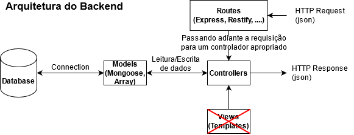

# ads-backend - 1º/2021

## Aulas ministradas ##
---------------
- **01-primeiro-exemplo**: Primeiros passos para inicialização do servidor e definição de rotas.
- **02-api-contatos**: API básica de contatos, sem validação.
- **03-api-contatos-validando-com-middlewares: uso de middlewares para realização de validação.
- **04-exercicio-api-produtos**: replicação da atividade contatos para produtos.
- **04-exercicio-api-produtos-solução**: solução da atividade.
- **05-criar-a-base-da-api-cjs: base da api utilizando a engine padrão do Node cjs: CommonJS.
- **06-criar-a-base-da-api-esm**: base da api utilizando a engine experimental do Node esm: ECMAScript module.
- **07-conexao-com-mongodb**: exemplo para estabelecer conexão com MongoDB remoto ou local, utilizando variáveis de ambiente definidas no arquivo .env.
- **08-criar-user-model+user-controller-de-base**: Código de base do modelo User, juntamente com o Controller e as rotas.
- **09-implementar-as-rotas-junto-com-mongodb**: Implementação básica das rotas no UserController
- **10-validando-user**: Implementação com validação dos campos no UserController, com o auxílio do Yup, além de outras validações.
- **11-paginacao-users**: Listar usuário com paginação.
- **12-exercicio-api-produtos-com-mongoose**: Resolução do exercício API Produtos com Mongoose.
- **13-auth-seguranca**: Implementação da rota de autenticação de login e autorização de acesso às rotas.
- **14-exercicio-api-produtos-com-auth-seguranca**: Autenticação e segurança para a API Produtos.
- **15-exercicio-api-carros-com-auth-seguranca**: Exercício avaliativo API Carros.
- **16-solucao-exercicio-api-carros-com-auth-seguranca**: Resolução do exercício API Carros com autenticação e segurança.
- **17-prova1a**: Projeto de base para a primeira prova.
- **18-criar-o-perfil-do-usuario**: Projeto do perfil do usuario, com autenticação e segurança.
- **19-api-pets-rotas-aninhadas-v1**:  Projeto de rotas aninhadas da API Pets (v1).
- **20-res-exercicios-api-professors-rotas-aninhadas-v1**: Exercicio avaliativo de rotas aninhadas da API Professors (v1).
- **21-api-pets-rotas-aninhadas-com-mongoose-v2**: Projeto de rotas aninhadas da API Pets (v2).
- **22-res-exercicio-api-professors-rotas-aninhadas-com-mongoose-v2**: Resolução do exercício avaliativo de rotas aninhadas da API Professors com Mongoose (v2).
- **23-versionamento-da-api-pets**: Implementação de versionamento de APIs, por meio das APIs Pets v1 e v2.
- **24-res-versionamento-da-api-professors**: Resolução da implementação de versionamento da API professors (v1 e v2). 